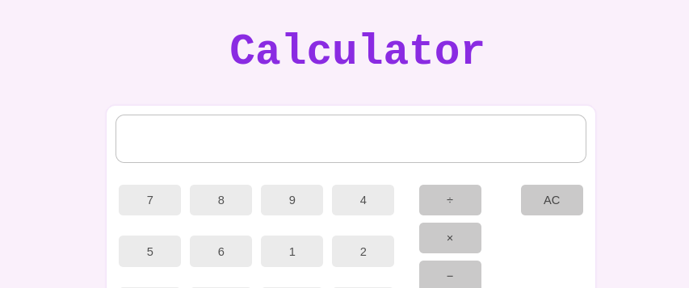

# Project Calculator

- KeyBoard Support Added
- You cannot add morethan one decimal

> Simple and easy-to-use calculator for quick arithmetic calculations.
> Perform addition, subtraction, multiplication, and division with just a
> click

[See livePreview ]
(https://isanka-maduwantha.github.io/TheOdinProject/04Calculator/index.html)
